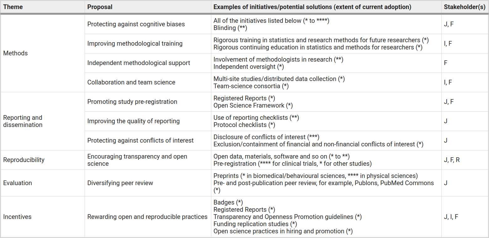

# open_science_presentation_20211111

My presentation on Open Science on 2021-11-11

 
# Problem

Undisclosed flexibility in data collection and analysis allows 
presenting anything as significant (adapted from [Simmons et al., 2011]):

The authors suggest six requirements for authors 
and four to reviewers to prevent this [Simmons et al., 2011]:

 * Authors:
   * Authors must decide the rule for terminating data collection before data collection begins and report this rule in the article
   * Authors must collect at least 20 observations per cell or else provide a compelling cost-of-data-collection justification
   * Authors must list all variables collected in a study
   * Authors must report all experimental conditions, including failed manipulations
   * If observations are eliminated, authors must also report what the statistical results are if those observations are included
   * If an analysis includes a covariate, authors must report the statistical results of the analysis without the covariate
 * Reviewers:
   * Reviewers should ensure that authors follow the requirements
   * Reviewers should be more tolerant of imperfections in results
   * Reviewers should require authors to demonstrate that their results do not hinge on arbitrary analytic decisions
   * If justifications of data collection or analysis are not compelling, reviewers should require the authors to conduct an exact replication

Another example: psi [Wagenmakers et al., 2011].

UNESCO recommends Open Science
and aims to teach it to the broader scientific
community (see https://en.unesco.org/science-sustainable-future/open-science)

# Current research practices

From [Hartgerink, 2016]:

 * Researchers systematically evaluate their own conduct as more responsible than colleagues, but not as responsible as they would like.
 * Transparent practices, facilitated by the Open Science Framework, help embody scientific norms that promote responsible conduct.
 * Questionable research practices harm the research process and work counter to the generally accepted scientific norms, but are hard to detect.
 * Research misconduct requires active scrutiny of the research community because editors and peer-reviewers do not pay adequate attention to detecting this. Tips are given on how to improve your detection of potential problems.

# HARK

From [Wicherts, 2017]:

> But besides fabricating data, there is another more mundane manner to cut through the empirical cycle and this strategy is called Hypothesizing after Results are Known or HARKing [10]. In one version of this strategy, the researcher collects a wealthy dataset and subsequently goes on a fishing expedition to find patterns that meet a significance threshold or appear meaningful on other grounds. Such fishing expeditions might uncover meaningful patterns, but they normally harvest old shoes that might appear impressive at first, but are fairly useless on closer inspection. Exploring data guarantees that one finds some extreme. I

# Transparency

Checklist for transparency from [Aczel et al., 2020]:

 * (1) Prior to analyzing the complete data set, a time-stamped preregistration was posted in an independent, third-party registry for the data analysis plan. 
 * (2) the study was preregistered
 * (4) the rationale for the sample size used (e.g., an a priori power analysis).
 * (5) the study design, procedures, and materials to allow independent replication.
 * (6) the measures of interest (e.g., friendliness) and their operationalizations (e.g., a questionnaire measuring friendliness). 
 * (8) distinguishes explicitly between "confirmatory" (i.e., prespecified) and "exploratory" (i.e., not prespecified) analyses. 
 * (9) the (processed) data, on which the analyses of the manuscript were based.
 * (10) all code and software (that is not copyright protected).
 * (11) all instructions, stimuli, and test materials (that are not copyright protected).
 * (12) The manuscript includes a statement concerning the availability and location of all research items, including data, materials, and code relevant to your study. 

# Recommended

See [Gopalakrishna et al., 2021, recommended].

A checklist of 34 degrees of freedom researchers have (from [Wicherts et al., 2016]):

 * Conducting explorative research without any hypothesis
 * Studying a vague hypothesis that fails to specify the direction of the effect
 * Creating multiple manipulated independent variables and conditions
 * Measuring additional variables that can later be selected as covariates, independent variables, mediators, or moderators
 * Measuring the same dependent variable in several alternative ways
 * Measuring additional constructs that could potentially act as primary outcomes
 * Measuring additional variables that enable later exclusion of participants from the analyses (e.g., awareness or manipulation checks)
 * Failing to conduct a well-founded power analysis
 * Failing to specify the sampling plan and allowing for running (multiple) small studies
 * Failing to randomly assign participants to conditions
 * Insufficient blinding of participants and/or experimenters
 * Correcting, coding, or discarding data during data collection in a non-blinded manner
 * Determining the data collection stopping rule on the basis of desired results or intermediate significance testing
 * Choosing between different options of dealing with incomplete or missing data on ad hoc grounds
 * Specifying pre-processing of data (e.g., cleaning, normalization, smoothing, motion correction) in an ad hoc manner
 * Deciding how to deal with violations of statistical assumptions in an ad hoc manner
 * Deciding on how to deal with outliers in an ad hoc manner
 * Selecting the dependent variable out of several alternative measures of the same construct
 * Trying out different ways to score the chosen primary dependent variable
 * Selecting another construct as the primary outcome
 * Selecting independent variables out of a set of manipulated independent variables
 * Operationalizing manipulated independent variables in different ways (e.g., by discarding or combining levels of factors)
 * Choosing to include different measured variables as covariates, independent variables, mediators, or moderators
 * Operationalizing non-manipulated independent variables in different ways
 * Using alternative inclusion and exclusion criteria got selecting participants in analyses
 * Choosing between different statistical models
 * Choosing the estimation method, software package, and computation of SEs
 * Choosing inference criteria (e.g., Bayes factors, alpha level, sidedness of the test, corrections for multiple testing)
 * Failing to assure reproducibility (verifying the data collection and data analysis)
 * Failing to enable replication (re-running of the study)
 * Failing to mention, misrepresenting, or misidentifying the study preregistration
 * Failing to report so-called “failed studies” that were originally deemed relevant to the research question
 * Misreporting results and p-values
 * Presenting exploratory analyses as confirmatory (HARKing)

Caused most stronly by [Gopalakrishna et al., 2021, questionable]:

 * Positive: publication pressure
   * I feel a pressure to publish
   * I experience stress at the thought of my colleagues’ assessment of my publications output.  
   * I have the feeling that my colleagues judge me mainly on the basis of my publications
   * Publication pressure harms my ability to do good research
   * The current publication climate puts pressure on relationships with fellow-researcher
   * Publication pressure sometimes leads me to cut corners
 * Negative: scientific norms
   * Researchers evaluate research only on its merit. 
   * Researchers judge each other’s contributions primarily on the basis of quality. 
   * The acceptance or rejection of claims entering the scholarly domain does not depend on the personal or social characteristics of researchers. 
   * No researchers' contribution to knowledge can be accepted without careful scrutiny. 
   * Researchers consider all new evidence, hypotheses, theories, and innovations, even those that challenge or contradict their own work. 
   * Researchers are motivated by the desire for knowledge and discovery, and not by the possibility of personal gain. 
   * Researchers are clear about what data their work is based on, and how results were achieved. 
   * Researchers put their work in the public domain to be read and used by other scientists and the general public
   * Researchers derive satisfaction from the mere act of doing research

# Questionable

See [Gopalakrishna et al., 2021, questionable].

# Manifesto for reproducible science

Threats to reproducible science [Munafò et al., 2017]:

Solutions to encourage reproducible science [Munafò et al., 2017]:

# Registered report

Registered report have a higher quality, quote from [Soderberg et al., 2021]:

> RRs numerically outperformed comparison papers on all 19 criteria (mean difference 0.46, scale range −4 to +4) with effects ranging from RRs being statistically indistinguishable from comparison papers in novelty (0.13, 95% credible interval [−0.24, 0.49]) and creativity (0.22, [−0.14, 0.58]) to sizeable improvements in rigour of methodology (0.99, [0.62, 1.35]) and analysis (0.97, [0.60, 1.34]) and overall paper quality (0.66, [0.30, 1.02]). 

# Examples of a hypothesis in a registered report

Hypothesis: The prevalence of statistical reporting inconsistencies differs between COVID-19 and matched 
non-COVID-19 preprints [Wicherts, 2021, covid]

## References

 * [Aczel et al., 2020] Aczel, Balazs, et al. "A consensus-based transparency checklist." Nature human behaviour 4.1 (2020): 4-6.

 * [Gopalakrishna et al., 2021, questionable] Gopalakrishna, Gowri, et al. "Prevalence of questionable research practices, research misconduct and their potential explanatory factors: a survey among academic researchers in The Netherlands." (2021).

 * [Gopalakrishna et al., 2021, recommended] Gopalakrishna, Gowri, et al. "Prevalence of responsible research practices and their potential explanatory factors: a survey among academic researchers in The Netherlands." (2021).

 * [Hartgerink, 2016] Hartgerink, Chris. "Research practices and assessment of research misconduct." ScienceOpen Research (2016).

 * [Munafò et al., 2017] Munafò, Marcus R., et al. "A manifesto for reproducible science." Nature human behaviour 1.1 (2017): 1-9.

 * [Simmons et al., 2011] Simmons, Joseph P., Leif D. Nelson, and Uri Simonsohn. "False-positive psychology: Undisclosed flexibility in data collection and analysis allows presenting anything as significant." Psychological science 22.11 (2011): 1359-1366.

 * [Soderberg et al., 2021] Soderberg, Courtney K., et al. "Initial evidence of research quality of registered reports compared with the standard publishing model." Nature Human Behaviour 5.8 (2021): 990-997.

 * [Wagenmakers et al., 2011] Wagenmakers, Eric-Jan, et al. "Why psychologists must change the way they analyze their data: the case of psi: comment on Bem (2011)." (2011): 426.

 * [Wicherts, 2021, covid] Wicherts, Jelte. "Comparing the prevalence of statistical reporting inconsistencies in COVID-19 preprints and matched controls: A Registered Report." (2021).

 * [Wicherts, 2021, misconduct] Wicherts, Jelte. "How misconduct helped psychological science to thrive." Nature 597.7875 (2021): 153-153.

 * [Wicherts et al., 2016] Wicherts, Jelte M., et al. "Degrees of freedom in planning, running, analyzing, and reporting psychological studies: A checklist to avoid p-hacking." Frontiers in psychology 7 (2016): 1832.

 * [Wicherts, 2017] Wicherts, Jelte M. "The weak spots in contemporary science (and how to fix them)." Animals 7.12 (2017): 90.

